# Dragon Fonts

## Original Font ROM from Dragon 200e (same as DragonFont 03.0 and 02.0)

On the original lowercase daughtercard for the Dragon200e, the font ROM was a 4kB 2532 EPROM, and the font was organized with the first byte of both the main and alternate font glyphs stored in consectuive memory locations, followed by the second lines, etc. I converted the data into a more easily parsed format, splitting the two sets of 128 font glyphs into their own files, and re-arranging the font data so that each font glyph is stored entirely in consecutive locations, meaning the first glyph comprises bytes 00-0f in the binary file.

[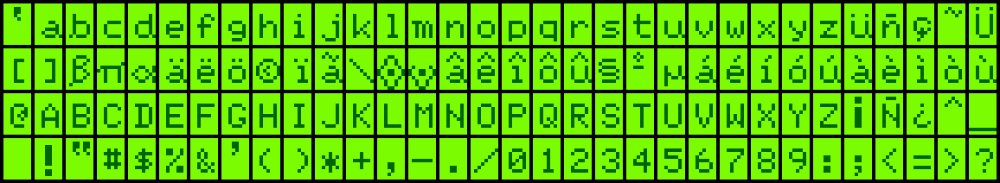](fixrom/rom26.ic1.0.bin)

## DragonPlus Lowercase Mod Fonts

DragonPlus Electronics makes a reproduction kit of the original design, available here: [Lower Case Text Upgrade for Dragon 32/64/200 &#8211; Kit Version (2023) &#8211; DragonPlus Electronics](https://dragonpluselectronics.com/product/lower-case-text-upgrade-for-dragon-32-64-200-kit-version-2023/) . They also shared a copy of the 32 fonts you can burn into a 27C256 (16 fonts) or 27C512 (all 32 fonts) here: [Dragon Lower Case Daughterboard Downloads – DragonPlus Electronics](https://dragonpluselectronics.com/dragon-lower-case-daughterboard-downloads/). The downloaded binary is organized the same way, with different sets of main and alternate fonts stored in consecutive 4kB locations in the binary. I first split the file into the 4kB char sets, and then split those into the individual font binaries. Some are duplicates, and the original Dragon 200e font is also duplicated here.

### Uppercase fonts

#### MC6847

[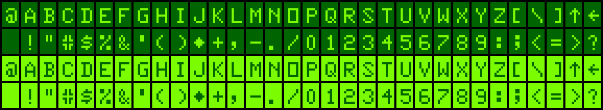](fixrom/DragonFont00.0.bin)

#### D32/64 compatible w. lower case – based on 200E character set

[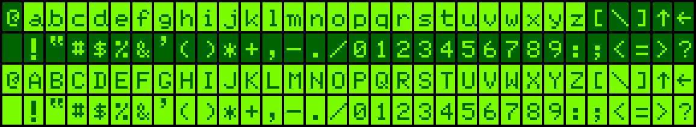](fixrom/DragonFont01.0.bin)

#### D32/64 compatible w. inv. Chars – based on 200E character set

[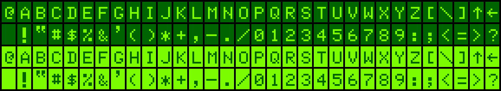](fixrom/DragonFont02.0.bin)

#### Original 200E character set

#### Spectrum w. lower case

[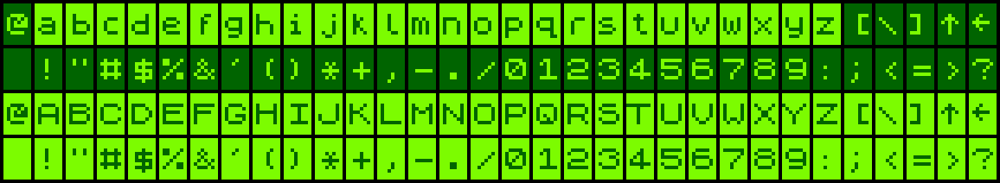](fixrom/DragonFont04.0.bin)

#### Spectrum w. inverse characters

[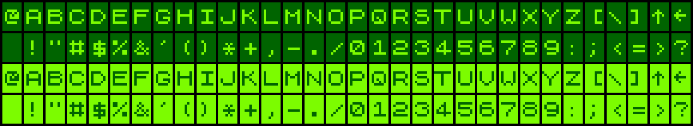](fixrom/DragonFont05.0.bin)

#### TI99/4A w. lower case

[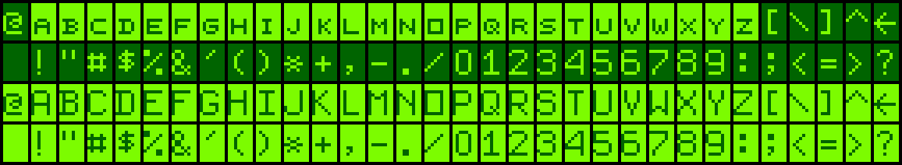](fixrom/DragonFont06.0.bin)

#### TI99/4A w. inverse characters

[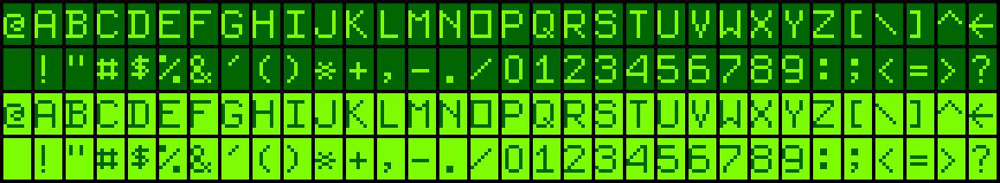](fixrom/DragonFont07.0.bin)

#### CGA Light for 200E – with accented chars etc.

[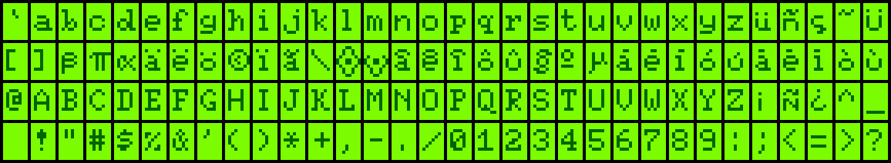](fixrom/DragonFont08.0.bin)

#### CGA Light for 200E – with accented chars etc.

#### CGA Light for D32/64 w. lower case

[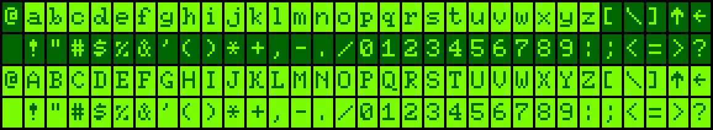](fixrom/DragonFont10.0.bin)

#### CGA Light for D32/64 w. inverse chars

[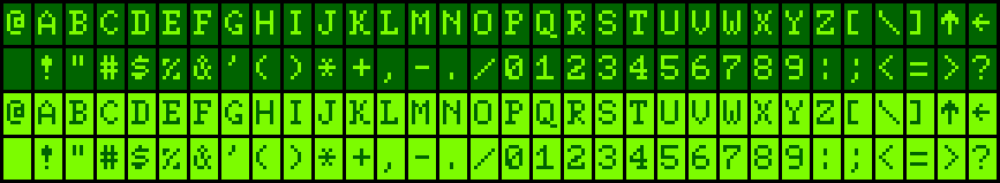](fixrom/DragonFont11.0.bin)

#### CGA Bold for 200E – with accented chars etc.

[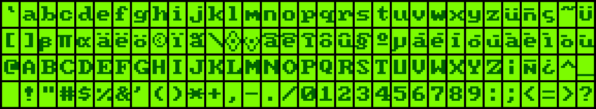](fixrom/DragonFont12.0.bin)

#### CGA Bold for 200E – with accented chars etc.

#### CGA Bold for D32/64 w. lower case

[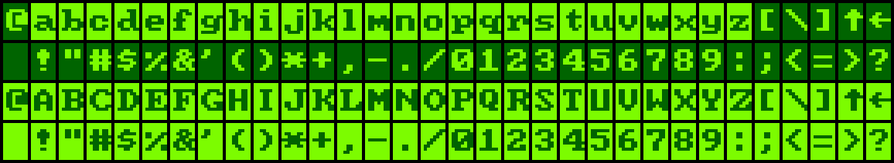](fixrom/DragonFont14.0.bin)

#### CGA Bold for D32/64 w. inverse chars

[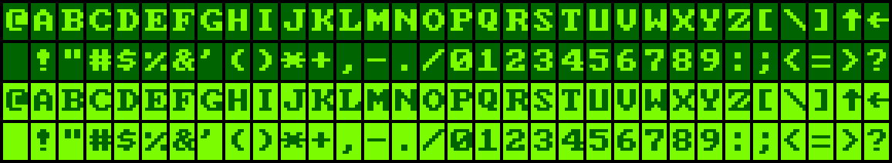](fixrom/DragonFont15.0.bin)

### Alternate (Inverse On) Fonts

#### MC6847

[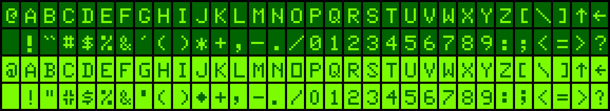](fixrom/DragonFont00.1.bin)

#### D32/64 compatible w. inv. Chars – based on 200E character set.

#### D32/64 compatible w. inv. Chars – based on 200E character set.

#### D32/64 compatible w. inv. Chars – based on 200E character set.

#### Spectrum w. inverse characters.

#### D32/64 compatible w. inv. Chars – based on 200E character set.

#### TI99/4A w. inverse characters.

#### D32/64 compatible w. inv. Chars – based on 200E character set.

#### Original 200E character set.

#### CGA Light for D32/64 w. inverse chars.

#### CGA Light for D32/64 w. inverse chars.

#### D32/64 compatible w. inv. Chars – based on 200E character set.

[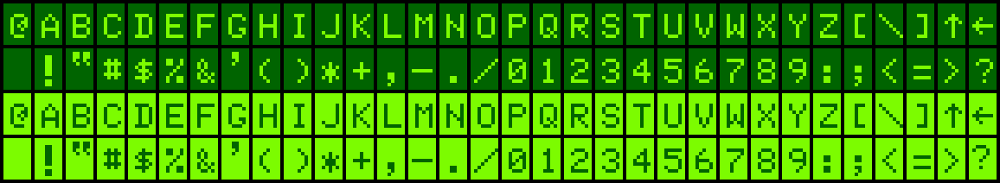](fixrom/DragonFont11.1.bin)

#### Original 200E character set.

#### CGA Bold for D32/64 w. inverse chars.

#### CGA Bold for D32/64 w. inverse chars.

#### D32/64 compatible w. inv. Chars – based on 200E character set.

[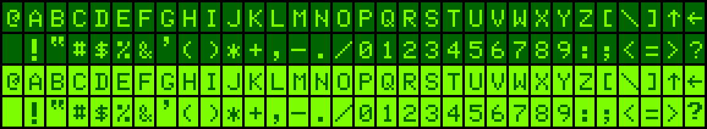](fixrom/DragonFont15.1.bin)
